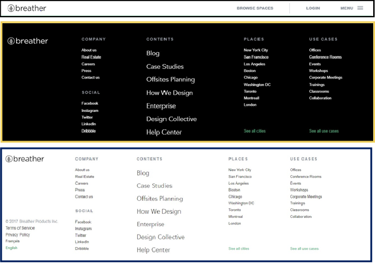
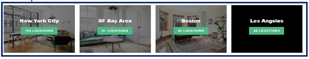
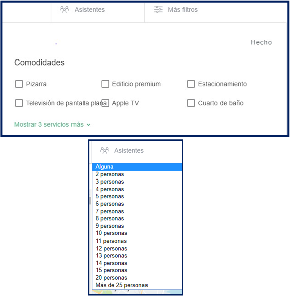
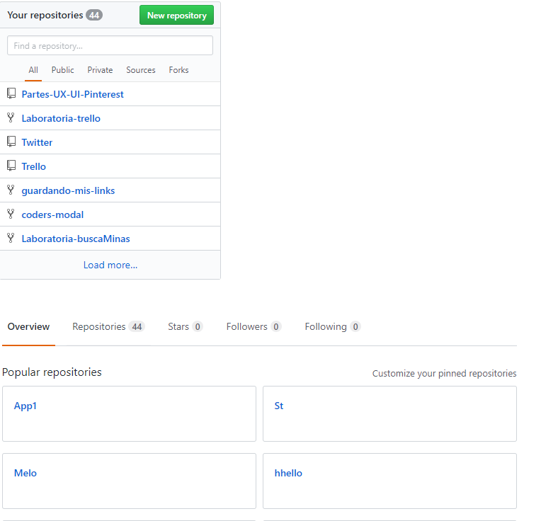
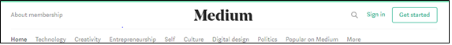
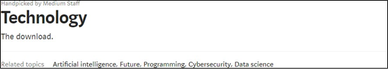

## Reto 2 : Elementos de navegación

#### Enunciado

* Identifica los elementos de navegación en los siguientes sites:
  1. Breather.
  2. Github.
  3. Medium.

#### Solución

  1. Elementos de navegación de Breather.

  **Global**

  

  **facetada**

  

  **Filtrada**

  

  **En Linea**

  

  **Conceptual**

  

  2. Elementos de navegación de GitHub.

  **Global**

  

  **facetada**

  

  **Conceptual**

  

  3. Elementos de navegación de Medium.

  **Global**

  

  **facetada**

  

  **Filtrada**

  

  **En Linea**

  

  **Conceptual**

  
